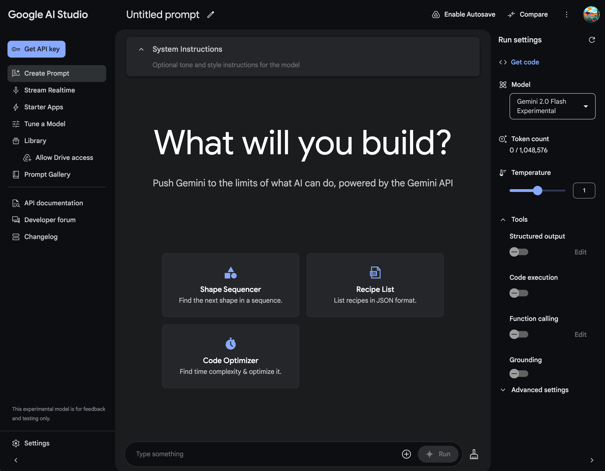
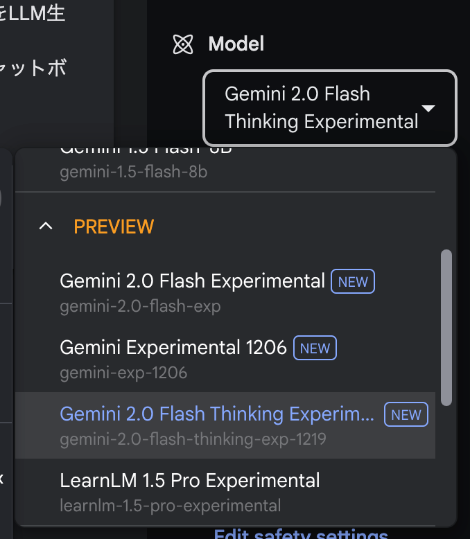
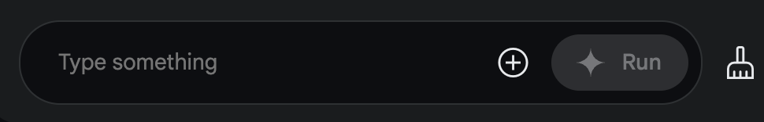

# エラー対応方法
ここではGoogle AI Studioで本書のエラー解決を行うチャットボットを作成する方法を紹介します。Google AI StudioはGoogleのLLMの動作をWeb上で試せるサービスです。

## 1.Google AI Studioを開く
以下URLを開き、Google AI Studioを開きます。

[Google AI Studio](https://aistudio.google.com/app/prompts/new_chat)

Googleアカウントでログイン後、以下のような画面が表示されます。

## 2.System Instructionにエラー解決チャットボット用のプロンプトを入力する
System Instruction部分に以下URLで表示されるプロダクトをすべてコピーして入力します。

[エラー解決チャットボット用のプロンプト](error_prompt.md)

## 3.モデルを選択する
今回のエラー解決チャットボットに適切なモデルを選択します。画面右上のモデル選択ボタンをクリックし、`Gemini 2.0 Flash Thiking Experimental`を選択します。

## 4.チャットボットに質問する
チャットボットに質問するために、チャットボットのメッセージボックスに質問を入力します。

## 5.もし、エラーが解決できない場合は
もし、エラーが解決できない場合は遠慮なく、Githubの[Issues](https://github.com/harukaxq/ai-driven-development-book-code/issues)にてご報告ください。

